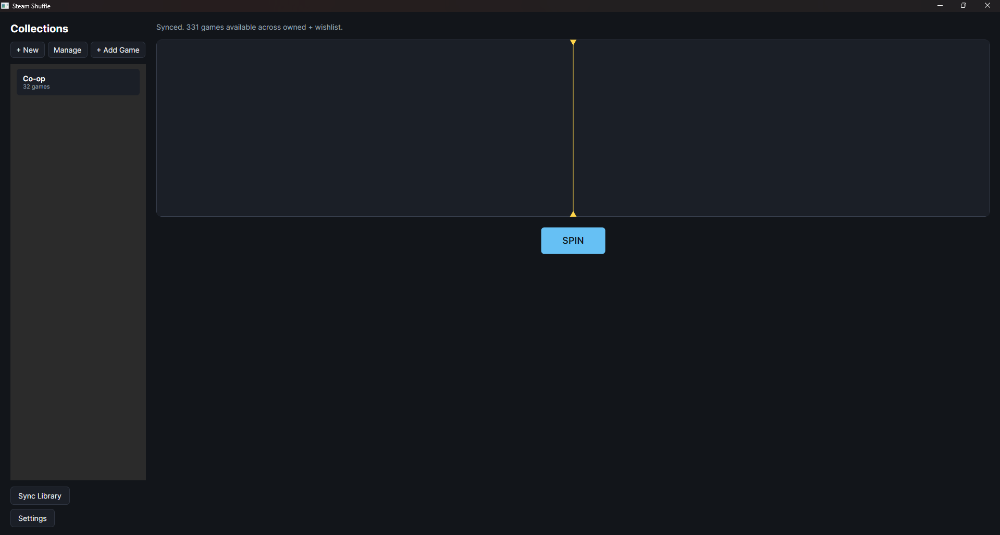
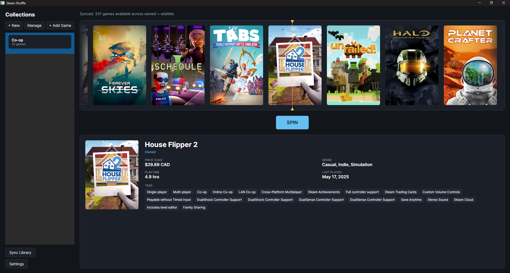
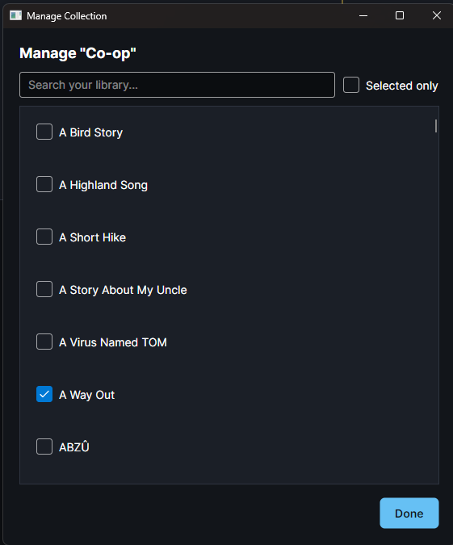
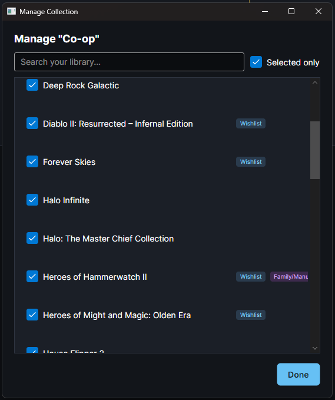
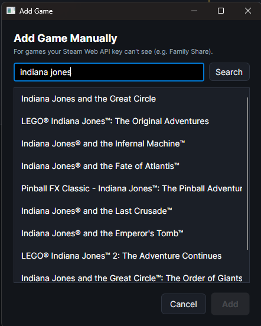
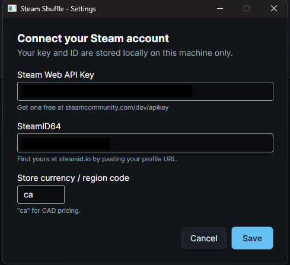

# Steam Shuffle

A cross-platform (Windows/Linux/macOS) desktop app, built with Avalonia UI,
that picks a random game from your own curated collections (pulled from your
owned Steam library **and** your wishlist), with a slot-machine style reveal
animation.

## Screenshots

<table>
<tr>
<td width="50%"><br/><sub>Ready to spin</sub></td>
<td width="50%"><br/><sub>Spin result</sub></td>
</tr>
<tr>
<td width="50%"><br/><sub>Manage a collection</sub></td>
<td width="50%"><br/><sub>"Selected only" filter</sub></td>
</tr>
<tr>
<td width="50%"><br/><sub>Add a game manually (e.g. Family Share)</sub></td>
<td width="50%"><br/><sub>Settings</sub></td>
</tr>
</table>

## Requirements

- .NET 8 SDK (Windows, Linux, or macOS) — https://dotnet.microsoft.com/download
- A Steam account with a public "Game details" privacy setting (needed so the
  app can read your owned games and wishlist)

## One-time setup

1. **Get a Steam Web API key**: https://steamcommunity.com/dev/apikey
   (any domain name works for personal use, e.g. `localhost`)
2. **Find your SteamID64**: paste your profile URL into https://steamid.io
   — you want the 17-digit number.
3. **Set your profile to public**: Steam → Profile → Edit Profile → Privacy
   Settings → set "Game details" (and ideally the whole profile) to Public.
   The wishlist endpoint in particular has no API-key-based access — it only
   works if this is public.

Run the app once, click **Settings**, and paste in your API key, SteamID64,
and a store region code (`ca` for CAD pricing).

## Running it

```
dotnet restore
dotnet run --project SteamShuffle
```

Or open `SteamShuffle.sln` in Visual Studio / Rider and hit Run.

## Running a downloaded release

Releases are self-contained single-file builds — no .NET install needed on
the target machine, one file per platform:

- **Windows**: unzip `SteamShuffle-<version>-win-x64.zip`, double-click
  `SteamShuffle.exe`.
- **Linux**: unzip `SteamShuffle-<version>-linux-x64.zip`, then
  `./SteamShuffle` (the zip preserves the executable bit; if it still won't
  run, `chmod +x SteamShuffle` first).
- **macOS**: unzip `SteamShuffle-<version>-osx-arm64.zip`. The binary is
  unsigned, so Gatekeeper will block it on first run — either right-click →
  **Open** and confirm, or run
  `xattr -d com.apple.quarantine SteamShuffle && ./SteamShuffle` in Terminal.

Same one-time Settings setup applies (API key, SteamID64, region code) as
running from source.

## Architecture

The solution is split into layered projects (dependency rule flows one way,
outer -> inner never the reverse):

- **`SteamShuffle.CoreModels`** — pure domain models/DTOs (`SteamGame`,
  `GameCollection`, `StoreDetails`, `StoreSearchResult`, `AppSettings`,
  `LibrarySyncProgress`) plus the `ICollectionRepository` abstraction. No
  dependencies.
- **`SteamShuffle.ApiClients`** — thin wrappers around the external Steam HTTP
  endpoints (`SteamWebApiService`, `SteamWishlistService`, `SteamStoreService`).
- **`SteamShuffle.Infrastructure`** — local persistence: `CollectionRepository`
  (SQLite) and `AppSettingsStore` (the `settings.json` file).
- **`SteamShuffle.Services`** — business orchestration (`LibraryManager`), which
  depends on Infrastructure only through `ICollectionRepository`, never the
  concrete SQLite class.
- **`SteamShuffle`** — the Avalonia presentation project (Views, Controls,
  MainWindow, App) and composition root.
- **`SteamShuffle.Tests`** — xUnit tests, folders mirror the project split.

## Running the tests

```
dotnet test
```

The `SteamShuffle.Tests` project (xUnit) covers:

- **`CoreModels/SteamGameTests`** — the display-string logic (playtime
  formatting, "Never" vs "N/A" vs a real date, free-vs-priced, owned/wishlist
  source badges).
- **`CoreModels/AppSettingsTests`** — the `IsConfigured` validation logic.
- **`Infrastructure/CollectionRepositoryTests`** — the SQLite layer: upsert
  merge semantics (owning a wishlisted game doesn't drop the wishlist flag or
  vice versa, playtime never regresses, a null last-played doesn't clobber a
  real one), store-detail round-tripping, staleness detection, and collection
  CRUD including duplicate-add and cascade-delete. Each test runs against its
  own temp SQLite file, so tests don't share state or touch your real library.
- **`ApiClients/SteamWebApiServiceTests`**, **`SteamWishlistServiceTests`**,
  **`SteamStoreServiceTests`** — JSON parsing against a fake `HttpMessageHandler`
  (no real network calls), including the "0 means never played" quirk,
  free-game price handling, and the privacy-related error messages.

## How it works

- **Owned games + playtime + last played** come from the documented Steam Web
  API (`IPlayerService/GetOwnedGames`).
- **Wishlist** comes from Steam's `IWishlistService/GetWishlist` endpoint —
  there's no officially documented, API-key-based way to read a wishlist, so
  this is the standard workaround every third-party Steam tool uses. It only
  needs your SteamID64, not the API key. (The older `wishlistdata` page
  endpoint this app used to call has since been retired by Valve and now just
  redirects to the store homepage.) This endpoint only returns app IDs, so
  wishlist entries show a placeholder name until the next store-details sync
  fills in the real one.
- **Price (CAD), genre, and store tags** come from the storefront `appdetails`
  endpoint, throttled to roughly 1 request/second and cached locally so you're
  not re-fetching on every launch. Note: what's shown as "tags" is Steam's
  official genre/category data (e.g. "Single-player", "Co-op", "Action") —
  the community-voted tags you see on store pages aren't exposed by any
  official API and would require HTML scraping, which this app deliberately
  avoids.
- Everything (owned/wishlist status, store metadata, your collections) is
  cached in a local SQLite database under your OS's app-data folder
  (`%AppData%\SteamShuffle\library.db` on Windows, `~/.config/SteamShuffle/`
  on Linux, `~/Library/Application Support/SteamShuffle/` on macOS). Your API
  key and SteamID64 live alongside it in `settings.json`. Nothing is sent
  anywhere except directly to Steam's own servers.
- If a wishlist placeholder name (e.g. "App 619820") is still showing after a
  sync, the next **Sync Library** keeps retrying that game's store details
  regardless of the normal 3-day cache window, until a real name comes back.
- Reel tiles show the library capsule art (tall, matches the tile shape) when
  available; if a game has no capsule image, the store's wide header banner
  is shown letterboxed instead of cropped, and if neither loads, the tile
  falls back to just the game's name.

## Using it

1. **Sync Library** — pulls your owned games + wishlist, and fills in store
   metadata for anything new. Safe to re-run any time; it only re-fetches
   store details older than 3 days.
2. **+ New** — create a collection (e.g. "Cozy Nights", "Couch Co-op").
3. Select a collection, click **Manage** — check off any owned or wishlisted
   game to add it. Wishlist games show a small "Wishlist" badge. Tick
   **Selected only** to filter the list down to just what's already in the
   collection, so you don't have to scroll the whole library to see its
   current membership.
4. **+ Add Game** — for games the Steam Web API can't see (most commonly
   Family Share titles, which never show up in `GetOwnedGames`), search by
   name, pick the match, and it's added to your library tagged
   "Family/Manual" so it can join collections and spins like any other game.
5. Select a collection and hit **SPIN**.

## Known limitations

- If your Steam profile (or just "Game details") is private, owned-games and
  wishlist fetches will fail with a clear error message telling you to check
  privacy settings.
- The `appdetails` endpoint is unofficial and can occasionally rate-limit or
  omit price data for region-restricted titles; those will show "N/A" for
  price rather than crash the sync.
- Family Share games never appear via the Steam Web API (no official endpoint
  exposes a family's shared library) — use **+ Add Game** to add them by hand.
